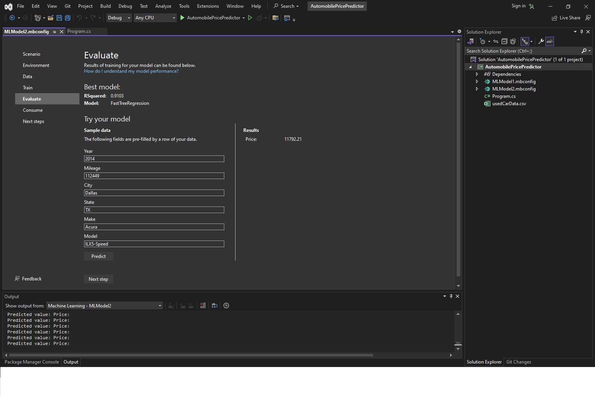
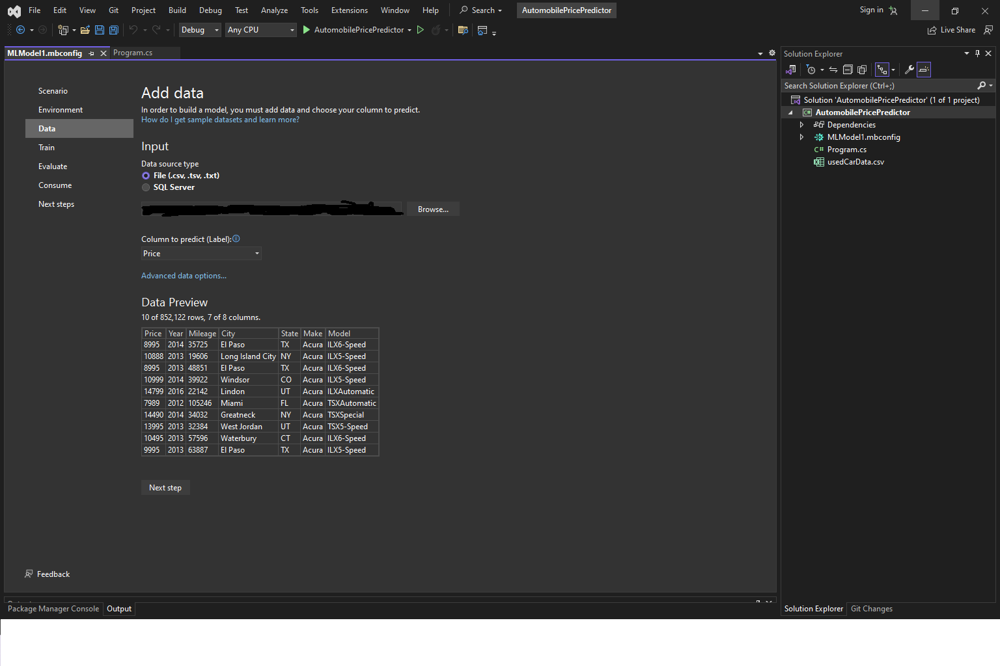

## Project Purpose:

Click the Medium button below to visit my article where I explain how I used ML.NET Model Builder 2022 to build this linear regression model.
  

In the last 5 years, the used car market in the United States has experienced various fluctuations. Chip shortages combined with the waning stability of the economy helped inflate the price of new and used cars drastically. Whether you are a dealer walking into a car auction or a consumer looking to score a good deal on a reliable vehicle, knowing what price to purchase or sell a vehicle for can be quite daunting. This project aims to provide clarity for all players in the market by providing its own price predictions.

This project features a command line tool that allows the user to predict the market price of an automobile in the United States. It uses a FastTree gradient boosting algorithm trained on a large Kaggle dataset containing over 500,000 automobile transactions. Its 407 separately trained decision trees built a 91% accurate model while implementing the ML.NET library. The consumption of the model has many practical applications for automobile enthusiasts, collectors or auto dealerships. To build more robust applications, the output of this project can be implemented into an API bolted to any user interface. 

  

 
## Instructions for Program.cs:

1. Ensure you are connected to the internet and your .NET 6 runtime is properly configured.

2. Open a terminal window and change the current directory to the project folder

3. In the terminal window, run:
	> dotnet Program.cs 
	
4. Enter the year, mileage, make, model, city and state for the vehicle.

9. Rerun the script to obtain more predictions.  

## Project Weaknesses:
There are two main weaknesses in this project.     First, the model used in this project was trained on a processor that could not handle the bandwidth of the decision tree  evaluations and crashed the host OS several times when ran. This leads to a less accurate model due to these hardware constraints. 
  Second, although Kaggle's dataset was very reliable, it didn't contain as much data as possible. Another dataset containing nearly 2 million entries was available, but will be used in later project versions.  

## Project Photos:  
  
  
  